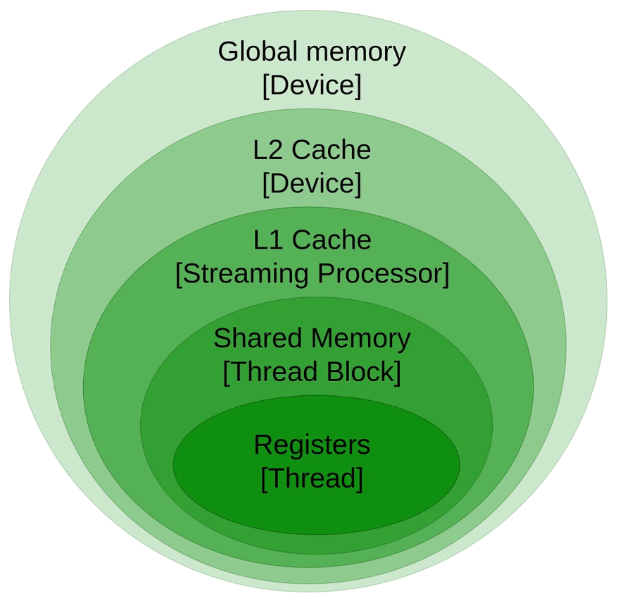

#

### This repo gives exclusive explaination of learning cuda and GPU in general, in a structured way

## GPU Architecture

- Each threads has there own private registers
- Each warp contains 32 threads
- thread Blocks are the chuncks of warps, depends on your gpu, modern gpu typically contains 32 warps; it is a 3d array of threads
- grid is the topmost layer having global memory, it is a 3d array of thread blocks

All GPU programs, known as kernels, are executed within this grid structure. When you launch a kernel, you specify both the grid size (the number of thread blocks) and the block size (the number of threads per block). This hierarchical approach ensures efficient computation and data management, allowing the GPU to handle extensive and complex tasks effectively. 

## Memory 
GPU has its own memory and it is independent of CPU, so therefore need to copy the stuffs from cpu to gpu to process the stuffs, and send it back to cpu for further use. The stuffs are not passed during compile time they are only passed at runtime through drivers
