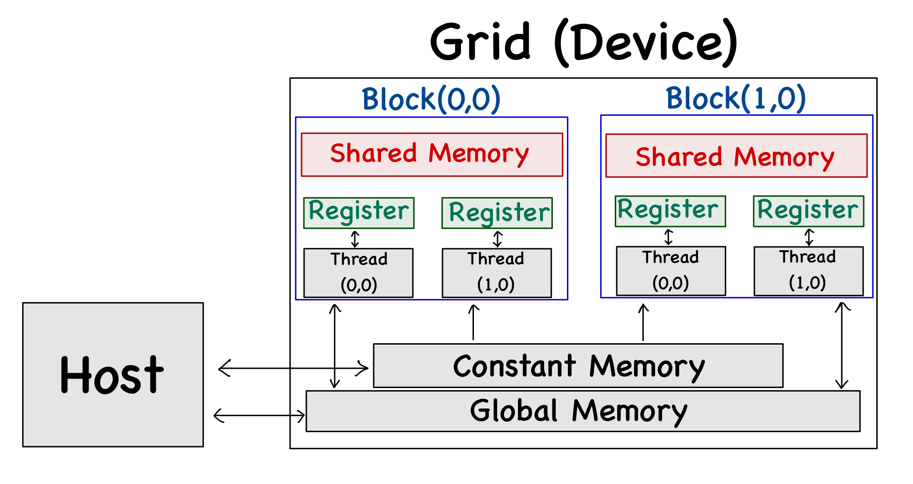
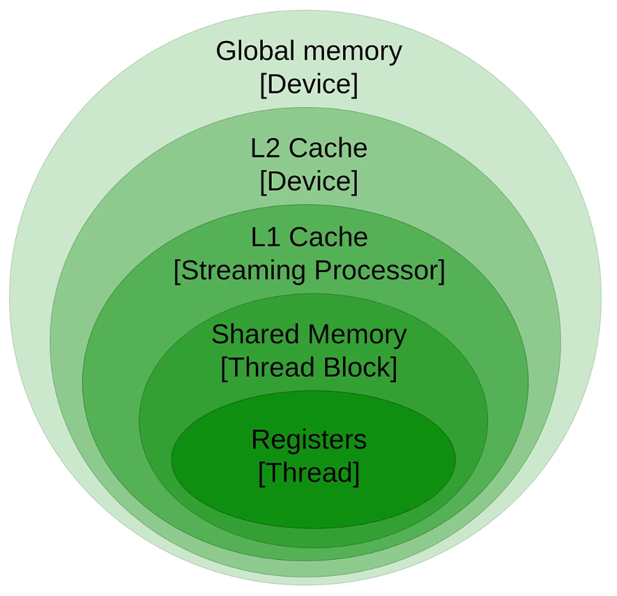

# Learning CUDA: From Fundamentals to Network Simulation

This blog series aims to make you learn GPUs working with the help of Cuda structurally, where you will be implementing the Watts-Strogatz small-world network model on GPUs at the end of the series. Each file represents a stage in understanding parallel computing.

## What you will learn
- GPUs working
- CUDA
- structuring algorithm into GPUs

This blog aim to give brief introduction to the architecture of GPUs and finally setting up environment and running hello world cuda program (you know basics :)  

### The Fundamental Difference

**CPUs are like a small team of experts** - few cores (4-16), each very smart, can do different tasks simultaneously (real multitasking).

**GPUs are like a massive factory floor** - thousands of simple workers (cores), all doing the same task on different data simultaneously (SIMT - Single Instruction Multiple Threads).


### GPU Architecture Hierarchy



Let's understand this from bottom-up:

##### 1. **Thread** - The Worker
- Smallest unit of execution
- Has its own **private registers** (fastest memory, ~100 cycles latency)
- Executes the same instruction as its warp-mates
- Example: Thread 0 processes array element 0, Thread 1 processes element 1, etc.

##### 2. **Warp** - The Squad (32 threads)
- Consists of **32 threads** always move together in lockstep
- All threads in a warp execute the **same instruction** at the same time
- **Critical concept**: If threads diverge (e.g., if-else), both paths execute sequentially = slower!
- Think: 32 workers on an assembly line, all doing the same step simultaneously

**Warp Divergence Example:**
```cuda
if (threadIdx.x % 2 == 0) {
    // Even threads execute this
} else {
    // Odd threads execute this  
}
// Within a warp, half threads are idle during each branch!
```

##### 3. **Thread Block** - The Department
- A 1D, 2D, or 3D array of threads (e.g., 256 threads = 8 warps)
- Max threads per block: typically **1024** (hardware dependent)
- Threads in a block can:
  - **Communicate** via **shared memory** (~300 cycles latency)
  - **Synchronize** using `__syncthreads()` (explained later)


**Example block configurations:**
- `dim3 block(256)` → 1D block of 256 threads (8 warps)
- `dim3 block(16, 16)` → 2D block of 256 (16*16) threads (good for matrices)
- `dim3 block(8, 8, 4)` → 3D block of 256 (8*8*4) threads (for volumes)

##### 4. **Grid** - The Company
- A 1D, 2D, or 3D array of thread blocks
- Software concept defined by kernel launch: `kernel<<<gridDim, blockDim>>>()`
- Each block is assigned to a Streaming Multiprocessor (SM)
- Blocks execute independently (order not guaranteed!)

**Launch Configuration:**
```cuda
// Launch 10 blocks, each with 256 threads = 2,560 threads total
kernel<<<10, 256>>>(data);

// 2D grid: 16x16 blocks, each block has 16x16 threads
dim3 grid(16, 16);
dim3 block(16, 16);
matrixKernel<<<grid, block>>>(matrix);
```

##### 5. **Streaming Multiprocessor (SM)** - The Factory Floor
- Physical hardware unit containing CUDA cores
- Modern GPUs: 40-100+ SMs (e.g., RTX 3080 has 68 SMs)
- Each SM can run multiple blocks simultaneously
- Has its own:
  - Warp schedulers
  - Shared memory (48-96 KB per SM)
  - L1 cache
  - Register file

#### Memory Hierarchy: The Critical Performance Factor



**Speed vs Size Tradeoff:**

| Memory Type | Size | Latency | Scope | Use Case |
|------------|------|---------|-------|----------|
| **Registers** | ~64 KB/SM | 1 cycle | Per-thread | Loop counters, temp variables |
| **Shared Memory** | 48-96 KB/SM | ~30 cycles | Per-block | Inter-thread communication |
| **L1 Cache** | 16-128 KB/SM | ~30 cycles | Per-SM | Automatic caching |
| **L2 Cache** | 4-6 MB | ~200 cycles | GPU-wide | Automatic caching |
| **Global Memory** | 4-24 GB | ~400-800 cycles | GPU-wide | Main data storage |
| **CPU (Host) Memory** | 16-128 GB | ~100,000 cycles | CPU only | Data transfer via PCIe |

**The Golden Rule:** Minimize global memory accesses, maximize register/shared memory usage.


#### Execution Model: SIMT (Single Instruction Multiple Threads)

**How a kernel executes:**

1. **Launch**: You call `kernel<<<grid, block>>>()` from CPU
2. **Distribution**: GPU runtime distributes blocks to available SMs
3. **Warp Execution**: SM's warp scheduler picks warps to execute
4. **Instruction Issue**: All 32 threads in a warp execute the same instruction
5. **Memory Latency Hiding**: While one warp waits for memory, scheduler runs another warp (zero-cost context switch!)

**Memory Transfer Pattern:**
```
CPU RAM ──cudaMemcpy──> GPU Global Memory ──kernel──> Process ──cudaMemcpy──> CPU RAM
   ↑                                                                              |
   └──────────────────────────────────────────────────────────────────────────────┘
```

**Why GPUs are Fast:**
- **Throughput over latency**: Don't make one thing fast, do many things at once
- **Latency hiding**: Thousands of threads means always someone ready to work
- **Massive parallelism**: 10,000+ threads running simultaneously

### Key Concepts Summary

**Thread Indexing (Most Important!):**

Thread indexing is how you figure out **"which thread am I?"** - this determines what data each thread should process. Its like assigning roll no. to the students.

#### **1D Indexing** - The Simple Case

**Formula:**
```cuda
int tid = blockIdx.x * blockDim.x + threadIdx.x;
```

**Breaking it down:**
- `threadIdx.x` = Your position **within your block** (0, 1, 2, ..., blockDim.x-1)
- `blockIdx.x` = Which block you're in (0, 1, 2, ...)
- `blockDim.x` = How many threads are in each block (e.g., 256)

**Visual Example:**
```
Launch: kernel<<<3, 4>>>()  // 3 blocks, 4 threads per block

Block 0:        Block 1:        Block 2:
[t0 t1 t2 t3]   [t0 t1 t2 t3]   [t0 t1 t2 t3]
 ↓  ↓  ↓  ↓     ↓  ↓  ↓  ↓     ↓  ↓  ↓  ↓
Global IDs:
 0  1  2  3     4  5  6  7     8  9 10 11

Calculation for thread 2 in Block 1:
tid = 1 * 4 + 2 = 6
```

##### **2D Indexing** - For Matrices

**Formulas:**
```cuda
// 2D indexing (for matrices)
int row = blockIdx.y * blockDim.y + threadIdx.y;
int col = blockIdx.x * blockDim.x + threadIdx.x;

// Convert to 1D index for array access (row-major order)
int index = row * WIDTH + col;
```


**Visual Example:**
```
Launch: matrixKernel<<<dim3(2,2), dim3(2,2)>>>()
// Grid: 2×2 blocks, each block: 2×2 threads

Matrix (4×4):
     col 0  col 1  col 2  col 3
row 0 [  0     1      2      3  ]  ← Block(0,0)  Block(0,1)
row 1 [  4     5      6      7  ]
row 2 [  8     9     10     11  ]  ← Block(1,0)  Block(1,1)
row 3 [ 12    13     14     15  ]

Block (0,0) processes:       Block (0,1) processes:
  threads cover row 0-1,       threads cover row 0-1,
  columns 0-1                  columns 2-3

Thread (0,0) in Block(0,0):
  row = 0 * 2 + 0 = 0
  col = 0 * 2 + 0 = 0
  → processes matrix[0][0]

Thread (1,1) in Block(0,1):
  row = 0 * 2 + 1 = 1
  col = 1 * 2 + 1 = 3
  → processes matrix[1][3]
```

**Synchronization:**
- `__syncthreads()`: Wait for all threads in a block till this point. It acts like a checkpoint that further execution should proceed only when all the threads has reached this point. 
- `cudaDeviceSynchronize()`: CPU waits for GPU to finish

**Memory Access Patterns:**

Understanding how threads access memory is **crucial** for GPU performance. The difference between good and bad memory patterns can mean 10× performance difference!

##### **Coalesced Access** - The Fast Way 

**What it means:** Consecutive threads (within a warp) access consecutive memory addresses.

**Why it's fast:** The GPU can combine 32 separate memory requests into just 1-2 transactions.


**Real-world analogy:** Imagine 32 people standing in line at a buffet. If they each take food from consecutive plates (plate 0, 1, 2, ..., 31), the line moves fast. This is coalesced access.


---

##### **Strided Access** - The Slow Way 

**What it means:** Threads access memory with regular gaps (strides) between addresses.

**Why it's slow:** Each warp might need multiple memory transactions instead of one. Some memory bandwidth is wasted loading data that won't be used.


**Real-world analogy:** The same 32 people at the buffet, but now they skip 3 plates between each person. The line moves slower because servers need to reach farther, and food in between is wasted.


**Common cause:** Accessing 2D arrays incorrectly:
```cuda
// BAD: Strided (column-major access in row-major storage)
float value = matrix[col * N + row];  // Adjacent threads access different rows

// GOOD: Coalesced (row-major access in row-major storage)  
float value = matrix[row * N + col];  // Adjacent threads access same row
```

---

##### **Random Access** - The Worst Way 

**What it means:** Threads access completely unpredictable, scattered memory locations.

**Why it's slowest:** Every thread might need its own separate memory transaction. No caching benefits. Total chaos for the memory controller.

**Real-world analogy:** The 32 people are now randomly teleporting to different buffet tables across different rooms. Complete chaos, no efficiency.

### Environment Setup

#### Prerequisites
- NVIDIA GPU (GTX 900 series or newer recommended)
- Windows 10/11, Linux, or macOS (with eGPU)

#### Installation Steps

**1. Install NVIDIA Driver**
```bash
# Check if driver is installed
nvidia-smi

# If not installed, download from:
# https://www.nvidia.com/Download/index.aspx
```

**2. Install CUDA Toolkit**
```bash
# Download from: https://developer.nvidia.com/cuda-downloads
# Choose your OS and follow installer

# Verify installation
nvcc --version
```

**3. Verify Setup**
```bash
# Check GPU info
nvidia-smi

# Expected output:
# +-----------------------------------------------------------------------------+
# | NVIDIA-SMI 535.xx       Driver Version: 535.xx       CUDA Version: 12.2    |
# |-------------------------------+----------------------+----------------------+
# | GPU  Name                     | Bus-Id        Disp.A | Volatile Uncorr. ECC |
# +-------------------------------+----------------------+----------------------+
# | Your GPU Model                | 0000:01:00.0    On   | N/A                  |
# +-------------------------------+----------------------+----------------------+
```

#### Compile and Run First Program

clone the repo
```
git clone https://github.com/SWASTIC-7/learning_gpu
```

**Compile and run:**
```bash
cd learning_gpu
# Compile
nvcc hello.cu -o hello.o

# Run
./hello

```
// Output:
```c
Hello World from CPU!
Hello World from Thread 0, Block 1, BlockDim 4
Hello World from Thread 1, Block 1, BlockDim 4
Hello World from Thread 2, Block 1, BlockDim 4
Hello World from Thread 3, Block 1, BlockDim 4
Hello World from Thread 0, Block 0, BlockDim 4
Hello World from Thread 1, Block 0, BlockDim 4
Hello World from Thread 2, Block 0, BlockDim 4
Hello World from Thread 3, Block 0, BlockDim 4
```